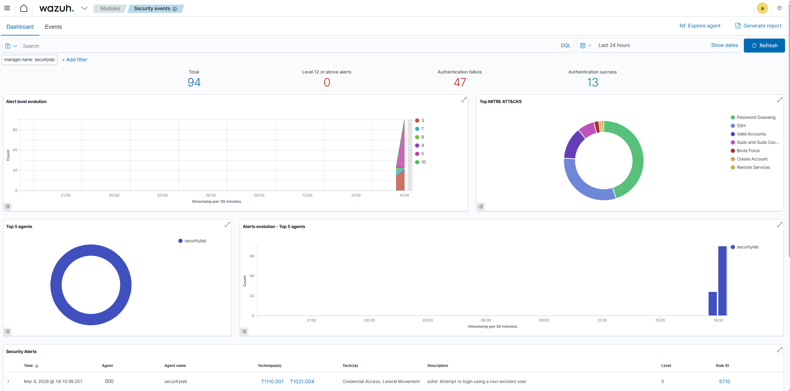
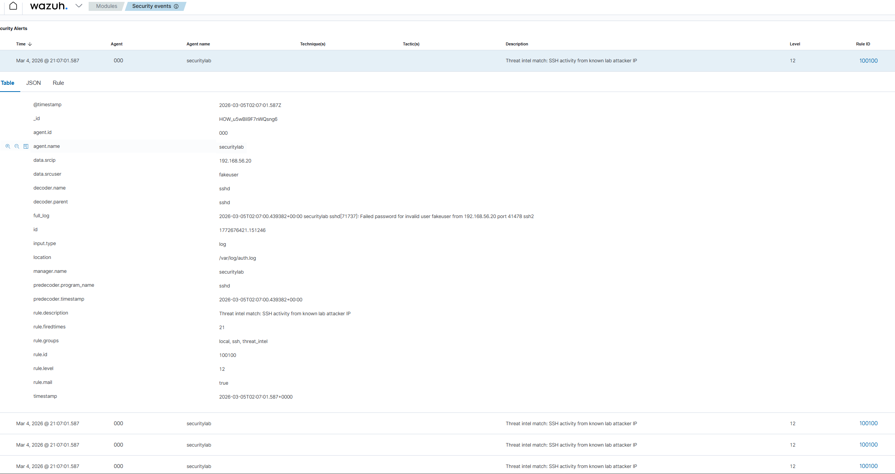

# Phase 6 – SIEM Deployment and Brute Force Detection

## Overview

In this phase I expanded the lab by deploying the Wazuh SIEM platform on the Ubuntu server to monitor security events and detect suspicious activity.

Wazuh manager and dashboard were installed on Ubuntu, then accessed through the web interface over HTTPS. The SIEM was configured to ingest Linux authentication logs, with `/var/log/auth.log` as the primary monitored source.

Once the SIEM was running, I launched another SSH brute force attack from the Kali attacker machine using Hydra. During this phase, the attacker source monitored in the custom detection workflow was `192.168.56.20`.

---

## Firewall Configuration Fix

During initial testing, the Wazuh dashboard was unreachable until the Ubuntu firewall was adjusted to allow HTTPS access.

```bash
sudo ufw allow 443/tcp
```

This allowed dashboard access from the host machine.

---

## Attack Simulation

- Attack launched from Kali Linux
- Tool used: Hydra
- Target: Ubuntu SSH service
- Result: repeated authentication failures generated on the target

---

## Log Monitoring and SIEM Ingestion

During the attack, the Ubuntu server generated repeated events in `/var/log/auth.log` and Wazuh ingested them for analysis.

Observed activity included:

- Failed SSH login attempts
- Invalid user authentication attempts
- Source IP tied to attacker activity

---

## Custom Detection Rule

A custom Wazuh rule was created in:

```
/var/ossec/etc/rules/local_rules.xml
```

The rule identifies SSH authentication failures from the known lab attacker IP and elevates severity for easier detection.

```xml
<group name="local,ssh,threat_intel">
  <rule id="100100" level="12">
    <if_sid>5710</if_sid>
    <srcip>192.168.56.20</srcip>
    <description>Threat intel match: SSH activity from known lab attacker IP</description>
  </rule>
</group>
```

---

## Alert Detection in Wazuh

Wazuh successfully generated alerts during the brute-force activity.

- Alert severity level: 12
- Rule ID: 100100
- Alert description references known attacker IP
- Events mapped to MITRE ATT&CK credential access techniques

---

## Visual Evidence



*Screenshot 1: Wazuh dashboard displaying multiple SSH authentication failure alerts generated during Hydra brute-force activity.*



*Screenshot 2: Custom rule alert in Wazuh (Rule ID `100100`, Level `12`) highlighting SSH authentication activity from the configured lab attacker IP.*

---

## Key Observations

- Multiple SSH authentication failures detected
- Alerts generated from `/var/log/auth.log`
- Source activity correlated with the attacker machine
- Custom local rule increased visibility for known attacker IP activity
- Security events visible and investigable in the Wazuh dashboard

---

## Phase Outcome

This phase confirmed:

- Successful deployment of a SIEM
- Real attack simulation from Kali to Ubuntu
- Log ingestion from Linux host authentication logs
- Custom detection rule creation and tuning
- Security alert investigation in the dashboard

End-to-end SOC-style workflow demonstrated:

Attack simulation
→ Log generation
→ SIEM ingestion
→ Custom detection rule
→ Security alert investigation
