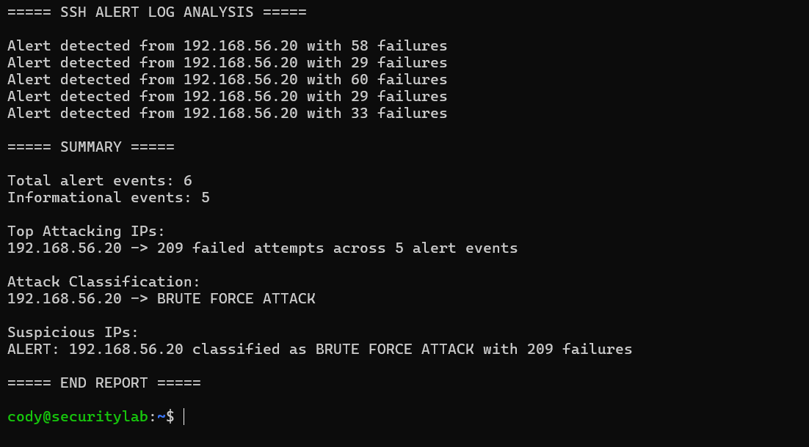
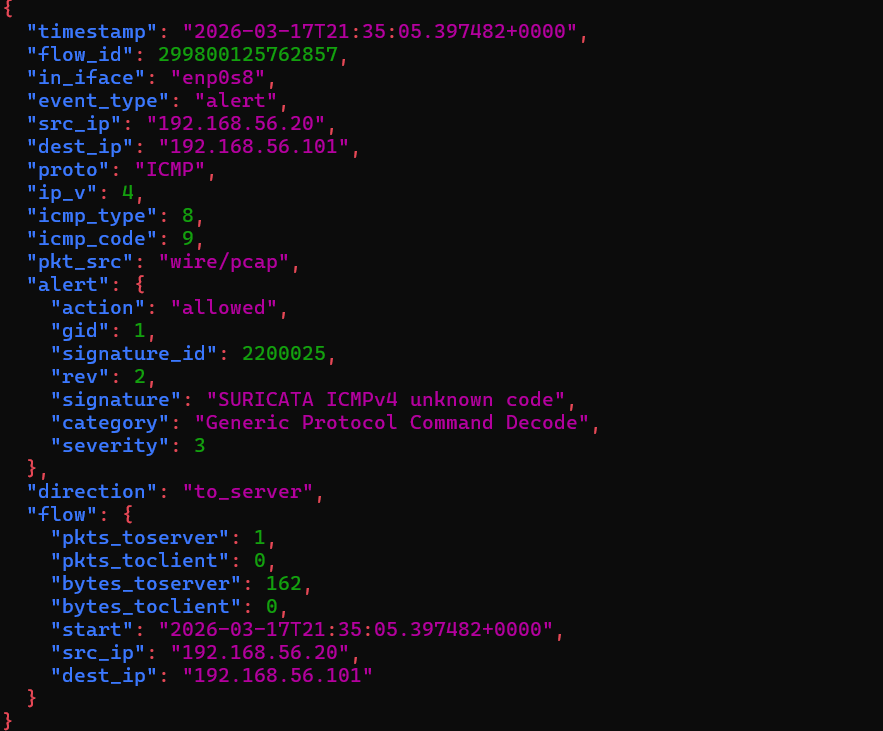

# Phase 7 – Python Log Analysis and Suricata IDS

## Overview

In this phase of the Linux Security Homelab, I expanded the monitoring capabilities of the environment by introducing **Python-based log analysis** and deploying **Suricata Intrusion Detection System (IDS)**.

The goal of this phase was to simulate real-world SOC monitoring workflows by combining:

- Host-based log monitoring
- Network intrusion detection
- Automated analysis using Python
- Attack simulation from a controlled attacker machine (Kali Linux)

This phase demonstrates how security tools can detect, analyze, and classify malicious activity occurring on a network.

---

## Lab Architecture

The lab environment consists of two virtual machines running in an isolated network:

| Machine | Role |
|------|------|
| Kali Linux | Attacker machine used to simulate brute force attacks and network scans |
| Ubuntu Server | Target system running SSH and security monitoring tools |

Traffic generated from Kali is analyzed by:

1. **SSH monitoring scripts**
2. **Python log analysis**
3. **Suricata IDS network monitoring**

---

## Part 1 – Python SSH Log Analysis

A custom Python script was created to analyze SSH alert logs generated by the monitoring system.

The script is located at:

```text
scripts/phase-7/log_analysis.py
```

### Script Artifact and Execution

Script path:

```text
scripts/phase-7/log_analysis.py
```

Run command:

```bash
python3 log_analysis.py
```

Generated report output:

```text
analysis_report.txt
```

The script parses `/var/log/ssh_alerts.log` to:

- Detect repeated SSH login failures
- Identify attacking IP addresses
- Count authentication attempts
- Classify attack severity

### Detection Logic

The script aggregates login failures by IP address and classifies activity based on thresholds:

| Failure Count | Classification |
|---------------|---------------|
| < 20 | Low |
| 20-49 | Medium |
| 50-99 | High |
| 100+ | **Brute Force Attack** |

This allows the script to automatically flag suspicious hosts.

---

### Example Python Analysis Output

The Python script detected repeated SSH login attempts originating from the attacker VM.



Example results:

```text
Top Attacking IPs:
192.168.56.20 -> 209 failed attempts across 5 alert events

Attack Classification:
192.168.56.20 -> BRUTE FORCE ATTACK
```

This confirms the SSH monitoring system successfully detected and classified brute force login activity.

---

## Part 2 – Suricata Intrusion Detection System

To expand monitoring beyond host logs, **Suricata IDS** was deployed to inspect network traffic and detect suspicious activity in real time.

Suricata analyzes packets on the monitored network interface and generates structured alerts in JSON format using the `eve.json` log.

### Suricata Deployment Steps

1. Installed Suricata and rule sets
2. Configured Suricata to monitor the lab network interface
3. Downloaded Emerging Threats rule sets
4. Enabled Suricata logging and alert generation
5. Simulated network attacks from Kali Linux

Suricata logs are stored at:

```text
/var/log/suricata/eve.json
```

---

### Example Suricata Alert

The following alert was generated when the attacker machine sent ICMP traffic to the target system.



Example alert fields:

```json
"event_type": "alert"
"src_ip": "192.168.56.20"
"dest_ip": "192.168.56.101"
"proto": "ICMP"
"signature": "SURICATA ICMPv4 unknown code"
"severity": 3
```

This confirms Suricata successfully detected network activity originating from the attacker system.

---

## Security Monitoring Workflow

The monitoring pipeline implemented in this phase works as follows:

```text
Attacker (Kali Linux)
|
v
Network Traffic Generated
|
v
Suricata IDS analyzes packets
|
v
Alert written to eve.json
|
v
SSH authentication logs generated
|
v
Python log analysis detects brute force activity
```

This workflow simulates the layered detection approach used by modern **Security Operations Centers (SOC)**.

---

## Skills Demonstrated

This phase demonstrates several security engineering and SOC-related skills:

- Python log parsing and analysis
- Linux authentication log monitoring
- Intrusion detection system deployment
- Network traffic inspection
- JSON alert analysis
- Attack simulation and detection
- Security event classification

---

## Future Improvements

Planned enhancements for later phases include:

- Correlating Suricata alerts with SSH login attempts
- Building automated attack attribution scripts
- Implementing centralized logging
- Creating detection dashboards

---

## Conclusion

Phase 7 expands the homelab from simple host monitoring into a **multi-layer security detection environment**.

By combining Python log analysis with Suricata network monitoring, the lab now simulates real-world detection workflows used in security operations centers.

This phase demonstrates practical experience with **log analysis, IDS deployment, and attack detection automation**.
